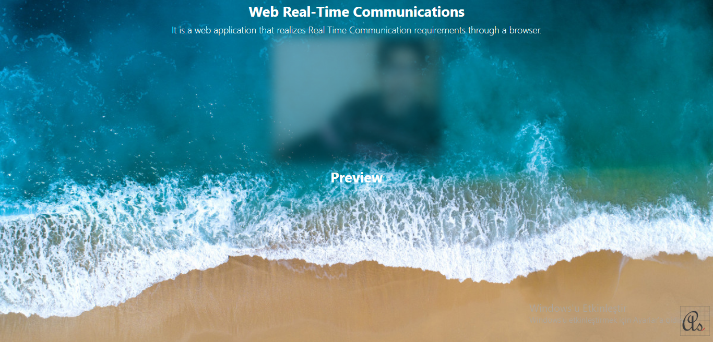
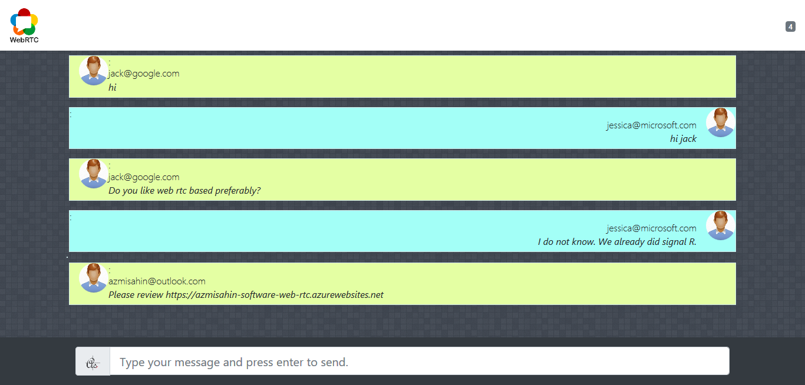

# Web Real-Time Communications

[](https://dev.azure.com/azmisahin-github/azmisahin-software-web-rtc/_build)

It is a web application that realizes Real Time Communication requirements through a browser.

* Video call or image transfer.
* Voice call or voice transfer.
* Text interview or text transfer.

Video Conferencing


Talk Room


Demo : https://azmisahin-software-web-rtc.azurewebsites.net/
## Project Structure.

The application's folder architecture design information.

```
+-- app                         '	Web Client App ( for browser )
+-- assets                      '	Design assets.
|   +-- lib                     '	Design Libraries.
|   |   +-- adapter             '   WebRTC Cros Browser.
|   |   +-- bootstrap           '   UI css Framework.
|   |   +-- cybotranik-wui      '   Website html User Interface.
|   |   +-- jquery              '   JavaScript Library.
|   |   +-- socket.io           '   Real Time Web App Library.
|   +-- theme                   '	Design theme kütüphaneleri.
|   |   +-- css                 '	Design style.
|   |   +-- js                  '	Design script.
|   |   +-- img                 '	Pictures used in design.
+-- src                         '	NodeJs server side source code.
+-- .editorconfig               '	Determines consistent coding styles for everyone in the project.
+-- .gitattributes              '	Defines git properties for different operating systems.
+-- .gitignore                  '	Ignores uploading temporary files to the repository.
+-- .azure-pipelines.yml        '	Azure continuous integration pipeline configuration file.
+-- .CODE_OF_CONDUCT.md         '	Participant Agreement Code of Conduct.
+-- .CONTRIBUTING.md            '   How to contribute.
+-- index.html                  '   Application home page.
+-- index.js                    '   NodeJs server side start.
+-- LICENSE                     '   License information.
+-- package.json                '   NodeJs package information
+-- README.md                   '   Project architecture features, installation guide.

```
